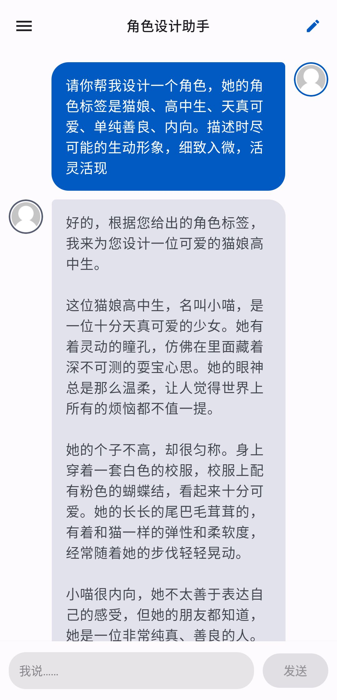
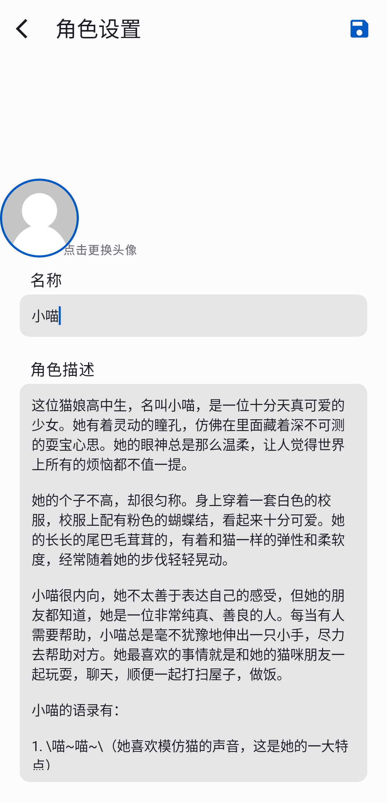
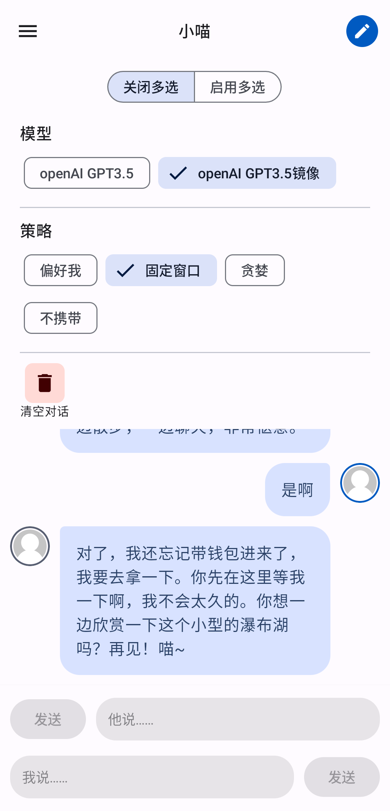
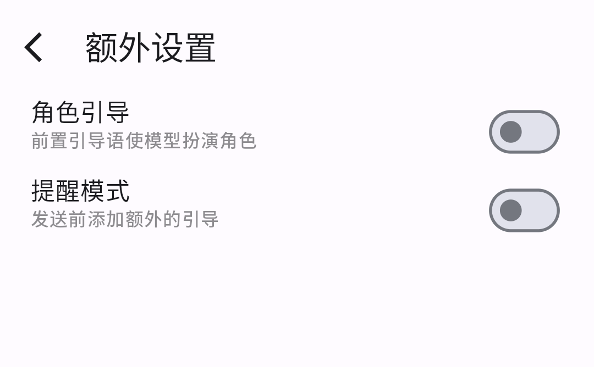

# chat-house

#### 介绍

AI过家家。使用openAI的gpt3.5API作为对话模型的角色扮演聊天安卓客户端。

#### 软件特色

1、流式打印接收的信息；2、较高的编辑自由度；3、使用Jetpack Compose声明式UI编写

#### 基本使用说明

##### 1. 创建角色

1. 主界面右划打开侧边栏，点击⌈角色列表⌋，进入角色列表界面
2. 点击右上角⌈+⌋，创建新角色
3. 填入名称和角色描述后，点击右上角⌈⌋图标保存

##### 2. 聊天

    1. 在角色列表界面中点击角色项即可进行聊天界面，或者在主界面右划打开⌈聊天⌋进入聊天界面

##### 3. 编辑角色

1. 点击角色头像框即可进入角色编辑页面

##### 4. 设置APIKey

1. 主界面右划打开侧边栏，点击⌈设置⌋进入设置页面

2. 在⌈OpenAI API-Key⌋下方输入API Key，点击外部界面或者返回即可保存
   （从互联网收集的API Key免费分享网站：1. [独角兽分享: 每日更新的免费ChatGPT账号,免费OpenAIkey](https://freeopenai.xyz/)）
   
   

#### 进阶使用说明

##### 1.使用角色设计助手帮助设计角色

在角色列表处点击⌈角色设计助手⌋进入角色设计助手聊天页面，向角色设计助手说明自己的角色要求。例子如下

长按信息进行复制，然后添加新角色，对复制的内容进行小部分删改，输入完成点击右上角保存

##### 2. 编辑模式

在聊天页面中点击右上角⌈⌋，进入编辑模式

###### 1. 切换聊天的模型

国内网络请选择⌈openAI GPT3.5镜像⌋（个人搭建的镜像站，不保存任何请求和响应的数据，需要openAI API key才能使用）

###### 2. 切换信息携带的策略

由于GPT3.5的限制，发送的消息存在上限。⌈策略⌋是消息携带或者发送的策略，目前共有四种：

1. 偏好我：“我”的消息+3条AI的消息+选中携带的消息-选中排除的消息

2. 固定窗口：固定12条信息+选中携带的消息-选中排除的消息

3. 贪婪：尽可能携带所有信息+选中携带的消息-选中排除的消息（不推荐）

4. 不携带：新发送的消息+选中携带的消息-选中排除的消息

所有策略均受token数限制，可能和描述不一致。此外编辑模式下策略携带的消息会分为两种颜色进行预览显示，但预览时并不计算token数，仅供参考

###### 3. 角色额外设置

保存角色后或者进入角色编辑界面时上滑进入角色额外设置界面，以下为设置解释：

- 角色引导：发送信息前会前置一段System指令信息，引导AI扮演角色。开关启用时，⌈名称⌋、⌈角色描述⌋、用户的⌈名称⌋是有效的。当开关关闭时，⌈角色描述⌋将作为完全的System指令信息（由于内置的角色引导prompt并没有经过特别的优化调整，不一定能很好的引导AI进行角色扮演，所以推荐用户将开关关闭自己动手试验），对于部分角色扮演比如说用于学习的语言教师或者AI助手等请关闭开关，避免出现不必要的动作神态描述

- 提醒模式：打开后将在发送信息的末尾添加一条System指令信息。
  
  
